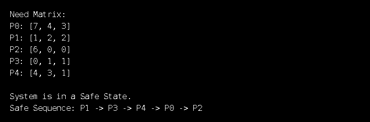
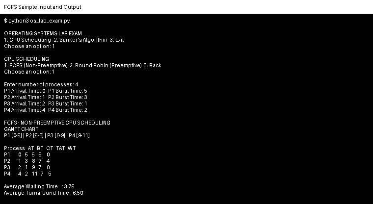
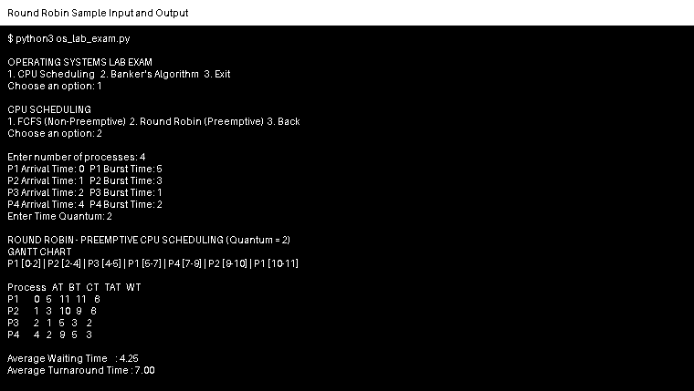

# Operating Systems Laboratory Exam

This repository contains the submission for the Operating Systems laboratory exam covering CPU scheduling and Banker's Algorithm.

## Algorithms Implemented

1. **FCFS (First Come First Serve)** — Non-preemptive CPU scheduling
2. **Round Robin** — Preemptive CPU scheduling
3. **Banker's Algorithm** — Deadlock avoidance and safe-state checking

## Files

- `os_lab_exam.py` — Complete Python source code with comments
- `sample_cpu_input.txt` — Sample console input for FCFS and Round Robin
- `sample_cpu_output.txt` — Sample CPU scheduling output
- `sample_banker_output.txt` — Sample Banker's Algorithm output
- `bankers_algorithm_output_screenshot.png` — Screenshot of the Banker's Algorithm output
- `SUBMISSION_CONTENTS.txt` — Submission file summary

## Requirements

- Python 3.x
- No external libraries are required.

## How to Run

### Ubuntu / Linux

```bash
python3 os_lab_exam.py
```

### Windows

```bash
python os_lab_exam.py
```

## Program Menu

```text
1. CPU Scheduling
2. Banker's Algorithm
3. Exit
```

Under CPU Scheduling:

- **FCFS (Non-Preemptive)**
- **Round Robin (Preemptive)**

For CPU scheduling, enter the number of processes, arrival time, burst time, and the time quantum when using Round Robin.

For Banker's Algorithm, enter the Allocation matrix, Maximum matrix, and Available resource vector.

## CPU Scheduling Output

The program displays:

- Gantt Chart
- Completion Time (CT)
- Turnaround Time (TAT)
- Waiting Time (WT)
- Average Waiting Time
- Average Turnaround Time

Formulas:

- `Turnaround Time = Completion Time - Arrival Time`
- `Waiting Time = Turnaround Time - Burst Time`

## Banker's Algorithm Output

The program displays:

- Need Matrix
- SAFE or UNSAFE state
- Safe Sequence, if one exists

The Need Matrix is calculated as:

```text
Need = Maximum - Allocation
```

### Sample Banker's Algorithm Output



## Notes

- All input is provided through the console.
- CPU scheduling process IDs use `P1`, `P2`, etc.
- Banker's Algorithm uses conventional `P0`, `P1`, etc. notation.
- The source code includes comments explaining the implementation.


## Sample Execution Screenshots

### FCFS — Sample Input and Output



### Round Robin — Sample Input and Output



These screenshots show the console inputs entered by the user together with the resulting Gantt chart, process table, Average Waiting Time, and Average Turnaround Time.
